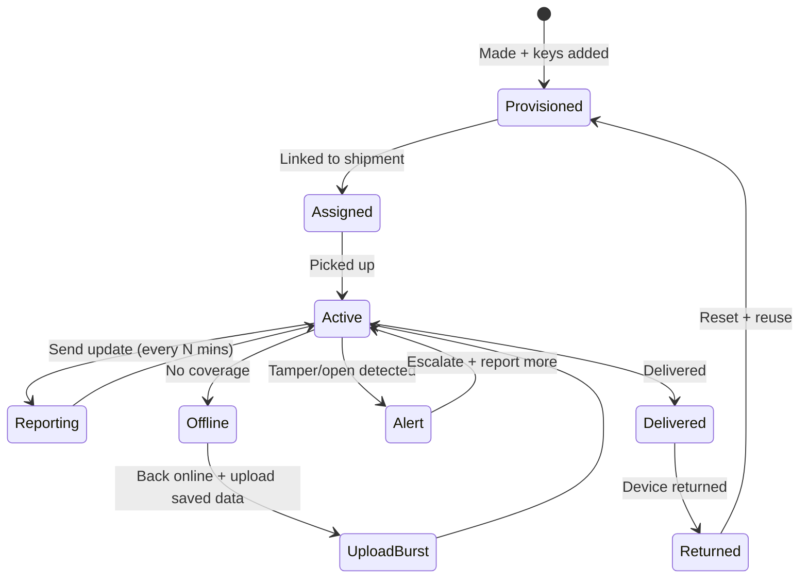
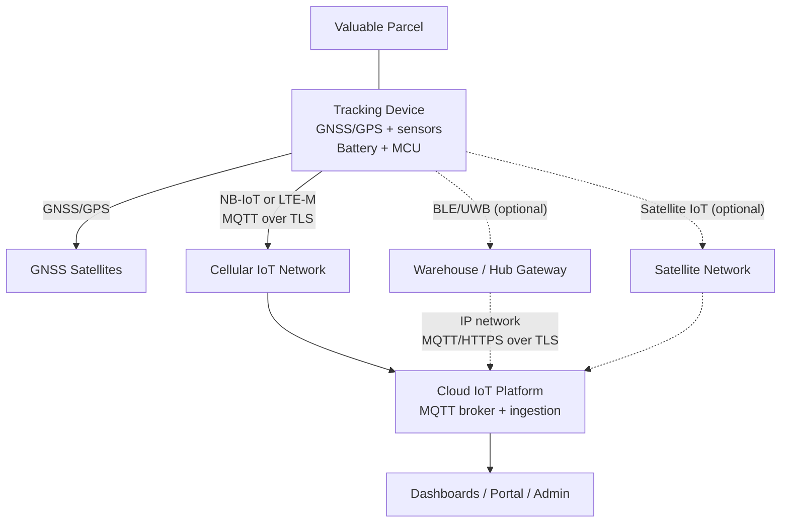
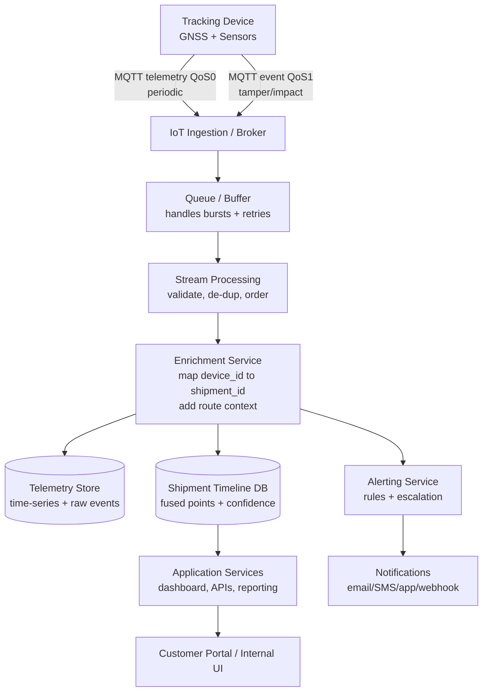

# IoT System Design: Parcel Tracking for Valuable Items

## Abbreviations

- **3GPP** — 3rd Generation Partnership Project
- **4G/LTE** — Fourth Generation / Long-Term Evolution
- **BLE** — Bluetooth Low Energy
- **CoAP** — Constrained Application Protocol
- **GNSS** — Global Navigation Satellite System
- **GPS** — Global Positioning System
- **HTTP** — Hypertext Transfer Protocol
- **IoT** — Internet of Things
- **LoRa** — Long Range
- **LTE-M** — LTE for Machines
- **LwM2M** — Lightweight Machine-to-Machine
- **MQTT** — Message Queuing Telemetry Transport
- **NB-IoT** — Narrowband Internet of Things
- **RFID** — Radio-Frequency Identification
- **SIM/eSIM** — Subscriber Identity Module / embedded SIM
- **UWB** — Ultra-Wideband
- **Wi-Fi** — IEEE 802.11 wireless networking

## 1. Selected topic

This report is about an IoT-based parcel tracking system for high-value shipments. Compared with standard logistics tracking that focuses on cost and throughput, the focus here is better visibility, better tracking integrity, and dependable operation in real transport conditions.

I describe the design through the main requirements and the trade-offs behind the choices.

### 1.1 Requirements

The goal is to track high-value parcels while they are being transported, even when they travel long distances and cross regions.

The main requirements are:

- Near real-time location updates (periodic tracking)
- Reliable service (the system should not easily go down)
- Secure communication and tamper-resistant data
- Coverage that works in many areas/regions
- Ability to scale to many shipments and devices
- Reasonable operating and maintenance cost

Priority levels:

- **Must-have:** regular location visibility, alerts for security events, protected data integrity, and buffering when the network is down (store-and-forward)
- **Should-have:** backup positioning methods (cell/Wi-Fi), confidence/accuracy info, and ingestion that can handle upload bursts after reconnection
- **Optional:** facility-level options like BLE/UWB, smarter adaptive reporting based on the route, and more advanced anomaly detection

Practical constraints:

- Limited battery/power on the device
- Unstable or changing network conditions
- Long device lifetime with minimal manual maintenance

#### 1.1.1 Evaluation parameters for trade-off analysis

I compared the options using these assumptions:

- **Update frequency:** periodic updates, usually every 5–30 minutes depending on risk, route, and battery limits
- **Latency:** when there is coverage, updates should appear within minutes; during coverage loss, delayed updates are acceptable
- **Positioning:** GNSS is the main source outdoors; indoor/urban cases use fallback methods
- **Outages:** the device buffers data locally and uploads later
- **Security events:** tamper/impact events are higher priority than normal telemetry

### 1.2 Existing similar applications or services

The system I’m designing is an IoT-based tracking service for high-value parcels. It combines periodic location updates, basic condition monitoring, and security-related events, and it keeps a clear shipment timeline that can be reviewed later.

| System / Product | Example | Primary tracking method | Near real-time location | Sensor telemetry | Tamper/security event | Offline buffering | Planned system advantage |
| --- | --- | --- | --- | --- | --- | --- | --- |
| Carrier tracking portals | UPS / FedEx tracking | Barcode scans at hubs | No | No | No | N/A | Adds visibility between checkpoints |
| Generic consumer trackers | Apple AirTag, Tile | BLE + phone network | Sometimes | Limited | Weak | Weak | Better enterprise reliability and controlled identity |
| Cellular asset trackers | Teltonika / Queclink asset trackers | GNSS + LTE-M/NB-IoT | Yes | Often yes | Sometimes | Often yes | Adds high-value shipment focus and stronger auditability |
| High-security logistics services | Brink’s / Loomis services | Mixed methods | Sometimes | Sometimes | Yes | Varies | More scalable and modular open-protocol design |

IoT adds value because barcode scans only tell you what happened at checkpoints. For high-value shipments, the “unknown time” between hubs is risky. With IoT updates, we can see the parcel’s last known location more often, collect condition data, and detect security events earlier, so the team can react faster instead of only investigating after something goes wrong [1][2].

### 1.3 Application details

This system supports several user views:

- **Operations dashboard:** map, shipment timeline, ETA/delay investigation, alert inbox, and incident evidence view
- **Security/risk console:** high-severity event triage, route deviation review, audit evidence export
- **Customer portal:** shipment status, latest known location, milestones, and optional notifications
- **Admin tools:** device provisioning, credential rotation, firmware updates, and integration configuration

### 1.4 Potential threats and ethical issues

Key risks and how to reduce them:

- **Location privacy:** route information can reveal sensitive business patterns. Mitigation: role-based access control and less detailed views for customers.
- **Insider misuse:** Mitigation: audit logs, approvals for sensitive actions, and separation of duties.
- **Data sharing risks:** Mitigation: scoped APIs, clear data-sharing rules, and data minimization.
- **False alarms:** Mitigation: well-chosen thresholds, confidence flags, and manual review for important alerts.
- **Evidence disputes:** Mitigation: strong device identity, authenticated messages, sequence numbers, and a clear chain-of-custody process.

## 2. Usage, users and use cases

### 2.1 Users and data stakeholders

The system has several types of users:

- **Logistics operations team:** monitors shipments, investigates delays, receives alerts, and triggers escalation
- **Security/risk team:** focuses on tamper events, route deviations, prolonged silence, and claim evidence
- **Customer service/account team:** provides updates and reports to customers
- **Customers:** view limited shipment status and optional notifications
- **System administrators:** manage devices, credentials, firmware, integrations, and access logs
- **External stakeholders:** carriers, insurance partners, auditors, and device vendors

Location and security data is sensitive. Access should follow a “need-to-know” rule. Customers usually see a simplified view, while internal teams can see more detailed data when they need it for investigation.

### 2.2 User amounts

Example scale (rough assumptions):

- **Active devices:** 10,000–100,000
- **Total registered devices:** 50,000–500,000
- **Internal users:** 50–1,000
- **Customer users:** 1,000–100,000

A rough example: with 50,000 active devices reporting every 15 minutes:

- Updates per device per day: 96
- Total telemetry per day: about 4.8 million messages
- Critical events are rarer but need higher priority delivery

So the backend needs to handle lots of small messages, and also handle reconnect “bursts” when devices upload buffered data.

### 2.3 State machine diagram (device lifecycle)

This diagram shows the “typical life” of one tracker device during a shipment. The device is prepared and linked to a shipment, then it runs in an active loop where it sends regular updates. If the network is down, it saves data locally and uploads everything once it reconnects. If a tamper/open event happens, it is treated as an alert and reporting can become more frequent. After delivery, the device is collected, reset, and reused for the next shipment.



## 3. Decisions and justifications

### 3.1 What we measure in the real world

The device mainly collects:

- **Location:** GNSS/GPS when possible; Cell-ID or Wi‑Fi when GPS is weak
- **Condition:** temperature and movement/impact
- **Security:** a simple tamper/open signal

GPS is the most accurate outdoors, but it can be bad indoors or between tall buildings, and it uses power. Because of that, we also keep “how sure we are” information (source + accuracy) with each location update.

#### 3.1.1 Sensors and how trustworthy the data is

The basic sensor set is:

- **GNSS/GPS:** outdoor location
- **Temperature sensor:** for goods that can be damaged by heat/cold
- **Accelerometer:** movement and impact
- **Tamper/open sensor:** tells us if the seal/case was opened

In real life these readings are not perfect. GPS can jump around, temperature can react slowly, and the accelerometer can trigger on normal handling. To avoid overreacting, the backend can do simple sanity checks (for example, “this speed is impossible” or “the signal looks noisy”).

#### 3.1.2 Uncertainty and confidence fields

Each location point should include:

- `source`
- `accuracy_m`
- `confidence`

This way, when someone looks at the map, it’s clear whether a point is “pretty exact” or just a rough estimate. If the device goes offline, it keeps timestamps and a sequence number so the backend can put the timeline back in the right order after reconnecting.

### 3.2 What the device needs to be able to do

The tracking device should support:

- **Low power mode:** sleep most of the time, wake up to measure + send
- **Local storage:** save data when the network is down
- **Simple local rules:** detect tamper/impact/temperature alarms
- **Connectivity options:** NB‑IoT or LTE‑M by default; BLE/UWB only inside facilities; satellite only for special routes
- **Lifecycle management:** provisioning, remote config, and firmware updates

MQTT is used to send telemetry and events. LwM2M can be used for device management tasks (diagnostics, config, firmware), so we don’t mix “management traffic” with the main telemetry stream.

### 3.3 How data is sent (and why)

We looked at three basic ways to send data:

- **Periodic reporting:** predictable battery and cost; good enough for tracking
- **Event-driven reporting:** great for tamper/impact/temperature alarms
- **Continuous streaming:** too expensive for battery devices

The chosen approach is **periodic + event-driven**: normal location/telemetry is sent every N minutes, but important events are sent right away (with higher priority). If the network is unavailable, the device stores data and uploads it later.

### 3.4 Communication setup and radio choice

#### 3.4.1 Communication pattern comparison

| Pattern | Pros | Cons | Fit decision |
| --- | --- | --- | --- |
| Device-to-Cloud | Works wherever there is cellular coverage; clear device identity; scales well | SIM/subscription cost; dead zones still happen | Default choice |
| Device-to-Gateway | Good indoors; better “within a warehouse” visibility | Needs gateways; only helps in places you control | Optional add-on |
| Device-to-Device | Could extend local reach | Hard to control; unpredictable in logistics | Not used |
| Backend data sharing | Useful for carriers/customers/insurance partners | Permissions and privacy become complex | Supported via APIs |

We pick Device-to-Cloud because parcels travel across many regions and we can’t rely on fixed infrastructure. Gateways (BLE/UWB) are only useful inside hubs/warehouses.

#### 3.4.2 Radio technology comparison

| Requirement | System needs | BLE | LoRaWAN | NB-IoT | LTE-M |
| --- | --- | --- | --- | --- | --- |
| Cost | 3 | 5 | 4 | 3 | 3 |
| Throughput | 2 | 3 | 1 | 2 | 3 |
| Energy efficiency | 5 | 5 | 5 | 4 | 3 |
| Infrastructure availability | 5 | 2 | 2 | 4 | 4 |
| Range | 5 | 1 | 4 | 4 | 4 |

Note on scoring: values are a simple 1–5 rating where **5 = better fit / more favorable** and **1 = worse fit / less favorable** for this use case. (For example, for **Cost**, 5 means lower/cheaper. For **Energy efficiency**, 5 means longer battery life.)

For this project, I’d mostly pick **NB‑IoT / LTE‑M** for wide-area tracking. **BLE** is mainly for indoor hubs. **LoRaWAN** can work, but it depends on whether gateways exist in the regions you ship to.

#### 3.4.3 NB-IoT vs LTE-M (simple rule)

- **NB-IoT:** better deep coverage and battery life; good for small, periodic messages [3]
- **LTE-M:** better for movement and lower delay; good when you need faster updates [3]
- **Rule of thumb:** use NB‑IoT by default; switch to LTE‑M when mobility/latency matters more than maximum battery life

#### 3.4.4 Power vs update rate

More frequent updates = better visibility, but more GPS fixes and more radio transmissions, so the battery drains faster. The plan is **adaptive reporting**:

- Report faster when the parcel is moving, off-route, or something looks wrong
- Report slower when it’s stable / low risk
- Buffer and upload later when there is no coverage

### 3.5 Protocol choice (keep it practical)

| Protocol | Communication model | Overhead | Advantages | Limitations |
| --- | --- | --- | --- | --- |
| HTTP | Request-response | High | Easy to build and debug | Too “heavy” for frequent small telemetry |
| MQTT | Publish-subscribe | Low | Lightweight; works well at scale; supports QoS | Needs a broker |
| CoAP | Request-response over UDP | Low | Made for constrained IoT devices | Smaller ecosystem for large deployments |

We use **MQTT** for telemetry and events because it’s lightweight and fits the “many devices sending small messages” case [4].

#### 3.5.1 MQTT topics and QoS (simple version)

Example topics:

- `parcel/{device_id}/telemetry`
- `parcel/{device_id}/event`
- `parcel/{device_id}/status`

QoS strategy:

- **QoS 0:** normal telemetry (save overhead)
- **QoS 1:** important events (tamper/impact/temperature alarms)
- **QoS 2:** avoid unless you truly need it

The device can keep a local buffer and a persistent session so it can recover from short outages and upload after reconnecting.

#### 3.5.2 LwM2M for management

LwM2M can run next to MQTT [5]:

- **MQTT:** sending telemetry/events
- **LwM2M:** provisioning, configuration, diagnostics, firmware updates

This keeps the “tracking data path” simple, while still allowing long-term fleet management.

### 3.6 Where processing happens

Most processing happens in the **cloud**:

- Validate and clean telemetry
- Remove duplicates and put delayed messages in the right order
- Link `device_id` to `shipment_id`
- Combine GPS + fallback positioning + facility events
- Trigger alerts and notifications

Gateway/edge processing can help inside a facility, but for wide-area shipping it adds complexity, so cloud-first is the practical default.

### 3.7 Security (what we actually need)

Main security goals:

- **Confidentiality:** protect location and condition data
- **Integrity:** make it hard to fake or change telemetry
- **Availability:** keep the system usable even when networks are unreliable

Key measures:

- Unique device identity + authentication
- TLS encryption
- Sequence numbers (ordering + replay protection)
- Optional MAC/signature for high-value evidence
- Backend role-based access + audit logs
- Tamper detection + “silence” escalation when the device stops reporting

#### 3.7.1 Threat model

| Threat | Mitigation |
| --- | --- |
| Device removal or replacement | Tamper sensor + binding device to shipment + identity checks |
| Jamming or long offline periods | Detect missing updates + escalate; store-and-forward |
| GNSS spoofing | Speed/route sanity checks; use fallback hints |
| Unauthorized onboarding | Secure provisioning + credential rotation |
| Backend account compromise | Least-privilege access + audit logs |

#### 3.7.2 Security across the device lifecycle

Security should cover the full device life:

- Secure manufacturing/provisioning
- Unique credentials per device
- Signed firmware updates
- Credential rotation
- Reset/wipe on decommissioning before reuse

## 4. End result – What the system looks like (architecture)

### 4.1 Physical architecture (devices + networks)

At a high level, the system has a small battery-powered tracker attached to each valuable parcel, plus the networks and cloud services that receive the data. The tracker collects location, basic condition data, and security-related events, then sends them to the cloud (mainly over cellular IoT).



Main parts:

- **Tracking device:** the hardware on the parcel (GPS, a few sensors, battery, MCU, and a cellular modem).
- **GNSS satellites:** give the device outdoor positioning.
- **Cellular IoT network:** NB‑IoT/LTE‑M is the default channel to send data.
- **Facility gateways (optional):** BLE/UWB gateways inside warehouses/hubs for indoor “last meters” visibility.
- **Satellite network (optional):** only for routes where cellular gaps are expected and the shipment value justifies the cost.
- **Cloud IoT platform:** receives messages (MQTT over TLS) and forwards them to backend services and apps.

Most of the time, the tracker uses **NB‑IoT/LTE‑M** and sends data with **MQTT over TLS** to the cloud IoT platform. In hubs/warehouses it can also use **BLE/UWB** through a gateway, and **satellite** is only a fallback for special routes with poor cellular coverage.

### 4.2 Logical architecture (services + data flow)

Below is the “software view” of how messages move through the system and become something people can use (maps, timelines, alerts, reports).



Explanation:

- **Ingestion/Broker:** receives MQTT messages from devices.
- **Queue/Buffer:** smooths traffic spikes (especially after reconnect).
- **Stream processing:** basic checks + removes duplicates + orders late data.
- **Enrichment:** links device → shipment and adds route/context.
- **Storage:** keeps raw telemetry (time-series) and a “clean” shipment timeline for UI.
- **Alerting + notifications:** rules that turn events into actions (warnings, escalations).

### 4.3 Data models (what a message looks like)

The main idea is: every message should be linkable to a device + shipment, and orderable by time/sequence number. For location, we also keep a few fields that explain the quality of the position.

#### 4.3.1 Common metadata fields

Typical fields used across messages:

- `device_id`: which tracker sent it
- `shipment_id`: which parcel/shipment it belongs to
- `timestamp`: when it happened on the device
- `backend_received_time`: when the backend got it
- `seq`: a sequence number to help ordering and de-dup
- `source`, `accuracy_m`, `confidence`: how the location was obtained + how accurate it is
- `sig` / `mac` (optional): extra integrity protection for high-value evidence

#### 4.3.2 Periodic telemetry (example)

```json
{
  "type": "telemetry",
  "device_id": "D-123456",
  "shipment_id": "S-2026-000045",
  "timestamp": "2026-04-29T10:15:00Z",
  "backend_received_time": "2026-04-29T10:15:08Z",
  "seq": 1842,
  "location": {
    "source": "gnss",
    "lat": 61.4978,
    "lon": 23.7610,
    "accuracy_m": 8,
    "confidence": 0.92
  },
  "battery_pct": 78,
  "signal_dbm": -95,
  "temperature_c": 6.5,
  "motion": {
    "moving": true,
    "impact_g": 0.3
  }
}
```

#### 4.3.3 Event message (example)

```json
{
  "type": "event",
  "device_id": "D-123456",
  "shipment_id": "S-2026-000045",
  "timestamp": "2026-04-29T10:18:12Z",
  "backend_received_time": "2026-04-29T10:18:20Z",
  "seq": 1850,
  "event": {
    "name": "tamper_detected",
    "severity": "high",
    "details": {
      "sensor": "seal_switch",
      "state": "open"
    }
  },
  "location_hint": {
    "source": "cell",
    "lat": 61.4980,
    "lon": 23.7625,
    "accuracy_m": 350,
    "confidence": 0.55
  }
}
```

## 5. Limitations and future improvements

### 5.1 Limitations

This design works well for many shipments, but it still has a few real-world limits:

- **Coverage gaps:** in remote areas (or during sea freight), cellular coverage may be weak or missing.
- **Battery trade-offs:** the more often we report location, the faster the battery runs out.
- **GPS isn’t perfect:** indoors and in dense city areas, GPS accuracy can get worse.
- **Cost:** compared with normal “scan-based” parcel tracking, this solution costs more, so it makes the most sense for valuable shipments.
- **False alarms:** impacts/temperature/tamper signals can sometimes trigger during normal handling if thresholds are not tuned well.

### 5.2 Future improvements

If I had more time, these are the improvements I would work on next:

- **Improve anomaly detection:** learn “normal routes and timing” and flag unusual behavior earlier.
- **Improve location confidence:** improve how we score/merge GNSS + cell/Wi‑Fi + facility signals.
- **Simplify device return/reuse:** make the “collect, reset, and redeploy” workflow smoother.
- **Support more networks:** support multiple carriers / profiles more easily (especially for roaming).
- **Add selective satellite fallback:** use satellite only for high-risk lanes where it’s worth the extra cost.
- **Improve evidence handling:** better packaging of “incident evidence” for insurance/audits (signing, export, chain-of-custody).

## 6. Conclusion

This report described a practical IoT-based tracking system for high-value parcels. Instead of only relying on barcode scans at hubs, the idea is to add a small tracker that sends regular updates during transport. With GNSS + cellular IoT, we can get location updates between checkpoints, and with temperature/motion/tamper signals we can capture basic “what happened” evidence when something goes wrong.

The final setup is simple in principle:

- Devices send telemetry and events to the cloud (Device-to-Cloud)
- MQTT is used as the main messaging protocol
- The device buffers data when offline and uploads later
- The backend cleans and orders messages, then builds a shipment timeline and triggers alerts

Connectivity choices are flexible: **NB‑IoT** is the default for battery life and coverage, while **LTE‑M** (and optional **BLE/UWB** or **satellite**) can be used when the route and risk level justify it.

| Requirement | Design choice | How it is satisfied |
| --- | --- | --- |
| Near real-time visibility | Periodic GNSS + cellular telemetry | Default about 15-minute updates with adaptive reporting |
| Reliability under outages | Store-and-forward + cloud ordering | Data is buffered and uploaded after reconnection |
| Security and integrity | Device identity, TLS, sequence numbers, audit logs | Helps reduce spoofing, tampering, and evidence disputes |
| Scalability | MQTT broker, queue, cloud processing | Supports many devices and burst uploads |
| Commercial viability | Modular add-ons | Extra features enabled only when needed |

Overall, the design is intentionally modular: wide-area tracking is the baseline, facility-level add-ons are optional, and security/event handling is built in so the system can support real operational and insurance needs for valuable shipments.

## Appendix. Additional supporting material

### A. Simple cost model

A simplified per-shipment cost model is:

```
Per-shipment cost ≈ device amortization + connectivity cost + operational cost - avoided loss/dispute cost
```

Where:

- **Device amortization** depends on device price, reuse cycles, and device loss rate
- **Connectivity cost** depends on reporting interval, network type, roaming, and satellite usage
- **Operational cost** includes activation, monitoring, returns, battery service, and exception handling
- **Avoided loss/dispute cost** represents the value gained from faster intervention and stronger evidence

### B. Default configuration example

| Item | Default choice |
| --- | --- |
| Reporting interval | Around 15 minutes |
| Connectivity | NB-IoT primary; LTE-M where mobility/latency requires |
| Sensors | GNSS, temperature, accelerometer, tamper/open indicator |
| Offline handling | Local buffer + upload after reconnection |
| Routine telemetry QoS | MQTT QoS 0 |
| Critical event QoS | MQTT QoS 1 |
| Alert policy | Warn after about 2 hours without update; escalate after about 6 hours on high-risk routes |

### C. AI Usage Statement

We used AI throughout the writing process as a support tool.

AI support was mainly used for:

- Drafting and rewriting paragraphs (language polishing)
- Restructuring sections and improving readability/flow
- Helping us list and clarify system requirements and constraints based on our description of the problem
- Suggesting what diagrams/tables to include (e.g., architecture diagrams, state machine, comparison tables) and helping with formatting
- Answering follow-up questions during the process when we needed to expand or explain parts of the design

After each step, we reviewed and edited the text ourselves to keep it consistent with the course topics and with our own design choices.

The final technical decisions (for example, choosing a device-to-cloud approach over other communication patterns, comparing radio options like NB‑IoT/LTE‑M/BLE/UWB/LoRaWAN, and using MQTT + TLS with store-and-forward buffering) are based on what we learned in the course, and we applied those concepts to practical constraints such as coverage, battery life, cost, and reliability.

## References

1. Hologram. (2026, February 2). *10 best IoT asset tracking systems*. Available at: https://www.hologram.io/blog/10-best-iot-asset-tracking-systems
2. Silicon Labs. (2023, October 31). *IoT Smart Tracking Streamlines Logistics Management End-to-End*. Available at: https://www.silabs.com/blog/iot-smart-tracking-streamlines-logistics-management
3. Nordic Semiconductor Developer Academy. (n.d.). *LTE-M and NB-IoT*. Available at: https://academy.nordicsemi.com/courses/cellular-iot-fundamentals/lessons/lesson-1-cellular-fundamentals/topic/lesson-1-lte-m-and-nb-iot/
4. OASIS. (2019). *MQTT Version 5.0 (OASIS Standard)*. Available at: https://docs.oasis-open.org/mqtt/mqtt/v5.0/mqtt-v5.0.html
5. Open Mobile Alliance (OMA). (n.d.). *What is LwM2M*. Available at: https://www.openmobilealliance.org/specifications/lwm2m/introduction/
