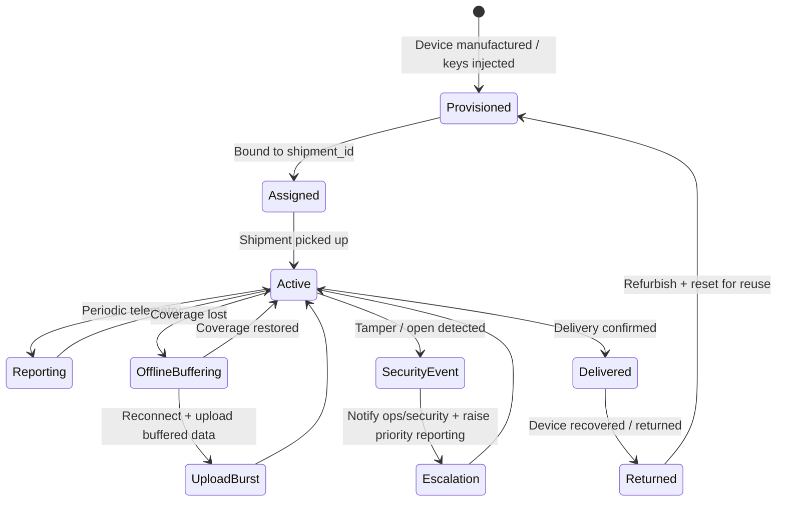
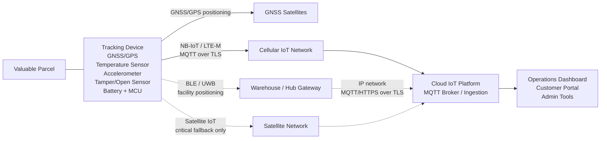
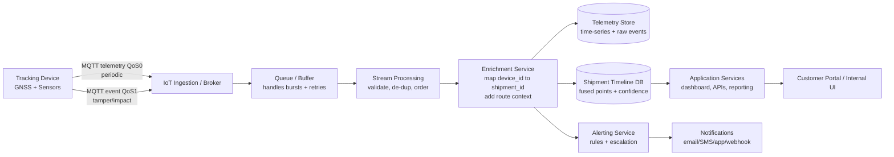

# IoT System Design: Parcel Tracking for Valuable Items

## Abbreviations

- **3GPP** — 3rd Generation Partnership Project
- **4G/LTE** — Fourth Generation / Long-Term Evolution
- **BLE** — Bluetooth Low Energy
- **CoAP** — Constrained Application Protocol
- **GNSS** — Global Navigation Satellite System
- **GPS** — Global Positioning System
- **HTTP** — Hypertext Transfer Protocol
- **IoT** — Internet of Things
- **LoRa** — Long Range
- **LTE-M** — LTE for Machines
- **LwM2M** — Lightweight Machine-to-Machine
- **MQTT** — Message Queuing Telemetry Transport
- **NB-IoT** — Narrowband Internet of Things
- **RFID** — Radio-Frequency Identification
- **SIM/eSIM** — Subscriber Identity Module / embedded SIM
- **UWB** — Ultra-Wideband
- **Wi-Fi** — IEEE 802.11 wireless networking

## 1. Selected topic

The Internet of Things (IoT) connects distributed devices that collect, process, and share data over networks. As IoT systems scale up, concerns such as reliability, energy use, security, and long-term operations become as important as the device hardware itself.

This report describes an IoT-based parcel tracking system intended for high-value shipments. Compared with conventional logistics tracking that optimizes for cost and throughput, the emphasis here is tighter visibility, stronger integrity of tracking records, and dependable operation under real transport conditions.

The design is presented through explicit trade-offs and the requirements that motivate them.

### 1.1 Requirements

The system is designed to track valuable parcels during transportation across potentially large geographic areas.

The key requirements are:

- Near real-time periodic location tracking
- High reliability and system availability
- Secure communication and data integrity
- Wide-area coverage across different regions
- Scalability to support large numbers of shipments
- Reasonable operational and maintenance cost

Priority and target indicators:

- **Must-have:** periodic location visibility, security event alerting, integrity-protected telemetry, and store-and-forward during outages
- **Should-have:** multi-source positioning fallback, confidence flags, and scalable ingestion for burst uploads after reconnection
- **Nice-to-have:** facility-level add-ons such as BLE/UWB, route-based adaptive reporting, and advanced anomaly detection

The system must also operate under practical constraints:

- Limited device power
- Variable network conditions
- Long device lifetime with minimal human intervention

#### 1.1.1 Evaluation parameters for trade-off analysis

To compare design options consistently, the following operating assumptions are used:

- **Update frequency:** periodic updates, typically 5–30 minutes depending on risk, route, and battery constraints
- **Latency expectation:** minutes-level availability when coverage exists; delayed delivery is acceptable during coverage loss
- **Positioning expectation:** GNSS is primary outdoors; indoor and urban performance is handled with fallbacks
- **Outage handling:** devices buffer data locally and upload later
- **Security events:** tamper/impact events are higher priority than routine telemetry

### 1.2 Existing similar applications or services

The planned system is an IoT-enabled high-value parcel tracking service that combines periodic location telemetry, condition monitoring, and security events with an auditable shipment timeline.

| System / Product | Primary tracking method | Near real-time location | Sensor telemetry | Tamper/security event | Offline buffering | Planned system advantage |
| --- | --- | --- | --- | --- | --- | --- |
| Carrier tracking portals | Barcode scans at hubs | No | No | No | N/A | Adds visibility between checkpoints |
| Generic consumer trackers | BLE + phone network | Sometimes | Limited | Weak | Weak | Better enterprise reliability and controlled identity |
| Cellular asset trackers | GNSS + LTE-M/NB-IoT | Yes | Often yes | Sometimes | Often yes | Adds high-value shipment focus and stronger auditability |
| High-security logistics services | Mixed methods | Sometimes | Sometimes | Yes | Varies | More scalable and modular open-protocol design |

IoT adds value because checkpoint scans cannot explain what happens between hubs. For high-value shipments, this uncertainty is costly. IoT telemetry provides periodic location visibility, condition evidence, and security events, enabling proactive response instead of only post-incident investigation.

### 1.3 Application details

This system provides different application views:

- **Operations dashboard:** map, shipment timeline, ETA/delay investigation, alert inbox, and incident evidence view
- **Security/risk console:** high-severity event triage, route deviation review, audit evidence export
- **Customer portal:** shipment status, latest known location, milestones, and optional notifications
- **Admin tools:** device provisioning, credential rotation, firmware updates, and integration configuration

### 1.4 Potential threats and ethical issues

Key risks and mitigations:

- **Location privacy:** shipment routes may reveal business-sensitive patterns. Mitigation: role-based access control and reduced-fidelity customer views.
- **Insider misuse:** mitigation through audit logs, approval workflows, and separation of duties.
- **Data sharing risks:** mitigation through scoped APIs, contractual limits, and data minimization.
- **False alarms:** mitigation through calibrated thresholds, confidence flags, and human review.
- **Evidence disputes:** mitigation through device identity, authenticated messages, sequence numbers, and clear chain-of-custody procedures.

## 2. Usage, users and use cases

### 2.1 Users and data stakeholders

The system supports several user groups:

- **Logistics operations team:** monitors shipments, investigates delays, receives alerts, and triggers escalation
- **Security/risk team:** focuses on tamper events, route deviations, prolonged silence, and claim evidence
- **Customer service/account team:** provides updates and reports to customers
- **Customers:** view limited shipment status and optional notifications
- **System administrators:** manage devices, credentials, firmware, integrations, and access logs
- **External stakeholders:** carriers, insurance partners, auditors, and device vendors

Location and security telemetry is sensitive. Access should follow a need-to-know principle. Customers usually receive a reduced view, while internal teams receive full-fidelity telemetry for incident response.

### 2.2 User amounts

Example scale assumptions:

- **Active devices:** 10,000–100,000
- **Total registered devices:** 50,000–500,000
- **Internal users:** 50–1,000
- **Customer users:** 1,000–100,000

Assume 50,000 active devices and a 15-minute reporting interval:

- Updates per device per day: 96
- Total telemetry per day: 4.8 million messages
- Critical events are rarer but need higher priority delivery

This justifies a backend that supports burst handling, elastic ingestion, and cost-aware storage.

### 2.3 State machine diagram (device and shipment lifecycle)



## 3. Decisions and justifications

### 3.1 Interfacing with the physical world

The system observes:

- **Location:** GNSS as primary source; Cell-ID/Wi-Fi fallback when GNSS is degraded
- **Condition:** temperature and motion/impact
- **Security:** tamper/open indicator

GNSS provides the best outdoor accuracy but performs poorly indoors or in urban canyons and consumes energy. Fallback positioning is less accurate, so the backend stores source, accuracy, and confidence for each location point.

#### 3.1.1 Sensor selection and data reliability

The core sensors are:

- **GNSS:** primary outdoor positioning
- **Temperature sensor:** condition monitoring for sensitive goods
- **Accelerometer:** motion and impact detection
- **Tamper/open sensor:** seal, light, or switch-based security evidence

Sensor data is not always absolute. GNSS can be noisy, temperature readings may lag behind real environmental changes, and impact sensors can produce false alarms during normal handling. To improve reliability, the system combines multiple signals and uses plausibility checks.

#### 3.1.2 Data uncertainty and confidence flags

Each location point should include:

- `source`
- `accuracy_m`
- `confidence`

This helps users understand not only where the parcel is, but how reliable that location estimate is. During offline periods, the device keeps timestamps and sequence numbers so the backend can rebuild the shipment timeline after reconnection.

### 3.2 Expectations on devices

The tracking device must support:

- **Low power operation:** sleep cycles and adaptive reporting
- **Local storage:** buffering during coverage outages
- **Basic local logic:** event detection for tamper, impact, and temperature thresholds
- **Connectivity:** NB-IoT/LTE-M as primary; BLE/UWB in facilities; satellite only where route risk justifies it
- **Lifecycle management:** secure provisioning, remote configuration, and firmware update capability

MQTT is used for telemetry and event messages. LwM2M can be used for provisioning, diagnostics, configuration, and firmware management.

### 3.3 Data delivery approaches

Three delivery approaches are considered:

- **Periodic reporting:** predictable power and cost; suitable for near real-time tracking
- **Event-driven reporting:** useful for tamper, impact, or temperature alarms
- **Continuous streaming:** high visibility but unsuitable for battery-powered parcel trackers

The selected approach is **hybrid periodic + event-driven**. Routine telemetry is periodic, while critical security and condition events are sent immediately with higher priority. Store-and-forward prevents data loss during outages.

### 3.4 Communication patterns and radio technology on end devices

#### 3.4.1 Communication pattern comparison

| Pattern | Pros | Cons | Fit decision |
| --- | --- | --- | --- |
| Device-to-Cloud | Works with cellular coverage; direct device identity; scalable ingestion | Subscription cost; coverage gaps | Selected as default |
| Device-to-Gateway | Efficient indoors; good facility visibility | Requires gateways; limited coverage | Optional facility add-on |
| Device-to-Device | Can extend local coverage | Complex and unpredictable | Not selected |
| Backend data sharing | Useful for carriers/customers/insurance | Governance and privacy complexity | Supported as integration layer |

Device-to-Cloud is selected because parcels move across wide areas and cannot depend on local infrastructure. BLE/UWB gateways are useful only in controlled facilities.

#### 3.4.2 Radio technology comparison

| Requirement | System needs | BLE | LoRaWAN | NB-IoT | LTE-M |
| --- | --- | --- | --- | --- | --- |
| Cost | 3 | 5 | 4 | 3 | 3 |
| Throughput | 2 | 3 | 1 | 2 | 3 |
| Energy efficiency | 5 | 5 | 5 | 4 | 3 |
| Infrastructure availability | 5 | 2 | 2 | 4 | 4 |
| Range | 5 | 1 | 4 | 4 | 4 |

NB-IoT and LTE-M best match the need for wide-area tracking. BLE is suitable for warehouses and hubs, while LoRaWAN depends on regional gateway availability.

#### 3.4.3 NB-IoT vs LTE-M

- **NB-IoT:** good deep coverage and energy efficiency; suitable for small periodic payloads
- **LTE-M:** better mobility and lower latency; useful for higher-speed movement or stricter responsiveness
- **Selection rule:** NB-IoT is the default, while LTE-M is used when mobility or latency is more important than maximum battery lifetime

#### 3.4.4 Power and update-frequency trade-off

More frequent updates improve visibility but increase GNSS fixes and radio transmissions, reducing battery life. Less frequent updates save power but reduce responsiveness.

The selected strategy is adaptive reporting:

- Faster reporting during movement, route deviation, or anomaly
- Slower reporting when stationary or low-risk
- Store-and-forward when connectivity is unavailable

### 3.5 Message delivery patterns and suitable protocols

| Protocol | Communication model | Overhead | Advantages | Limitations |
| --- | --- | --- | --- | --- |
| HTTP | Request-response | High | Simple and widely supported | Inefficient for frequent constrained telemetry |
| MQTT | Publish-subscribe | Low | Lightweight, scalable, supports QoS | Requires broker |
| CoAP | Request-response over UDP | Low | Lightweight and IoT-oriented | Less mature ecosystem for large-scale operations |

MQTT is selected for telemetry and event delivery because it is lightweight, asynchronous, and well suited for many devices publishing small messages.

#### 3.5.1 MQTT topic structure and QoS strategy

Example topics:

- `parcel/{device_id}/telemetry`
- `parcel/{device_id}/event`
- `parcel/{device_id}/status`

QoS strategy:

- **QoS 0:** routine telemetry to reduce overhead
- **QoS 1:** critical events such as tamper, impact, and temperature alarms
- **QoS 2:** avoided because of higher overhead

Persistent sessions and local buffering help with reconnect bursts after outages.

#### 3.5.2 LwM2M for device management

LwM2M can be used alongside MQTT:

- **MQTT:** telemetry and event path
- **LwM2M:** provisioning, configuration, diagnostics, and firmware updates

This separation keeps telemetry efficient while still supporting long-term fleet management.

### 3.6 Data processing and computing paradigm approaches

The selected paradigm is **cloud-based processing by default**.

Cloud responsibilities include:

- Validating telemetry
- De-duplicating repeated messages
- Ordering delayed messages
- Mapping `device_id` to `shipment_id`
- Fusing GNSS, fallback location, and facility events
- Triggering alerts and notifications

Edge or gateway processing may be useful in facilities, but it increases infrastructure complexity. For wide-area parcel tracking, cloud-centric processing is the most practical default.

### 3.7 Security considerations

Security goals:

- **Confidentiality:** protect location and condition data
- **Integrity:** prevent forged or altered telemetry
- **Availability:** support incident response even during unreliable connectivity

Key measures:

- Per-device identity and authentication
- TLS for transport security
- Sequence numbers for ordering and replay detection
- Optional MAC/signature for high-value evidence
- Backend RBAC and audit logs
- Tamper detection and offline/silence escalation

#### 3.7.1 Threat model

| Threat | Mitigation |
| --- | --- |
| Device removal or replacement | Tamper switch, device-shipment binding, identity checks |
| Jamming or prolonged offline | Silence detection, escalation, store-and-forward |
| GNSS spoofing | Route/speed plausibility checks, fallback positioning |
| Unauthorized onboarding | Secure provisioning and credential rotation |
| Backend account compromise | Least-privilege access and audit logs |

#### 3.7.2 Lifecycle security

Security must cover the whole device lifecycle:

- Secure manufacturing and provisioning
- Unique device credentials
- Signed firmware updates
- Credential rotation
- Decommissioning or reset before reuse

## 4. End result - Architecture and structure of your system

### 4.1 Physical architecture – Devices and communication technologies

The physical architecture consists of battery-powered parcel tracking devices, wide-area communication networks, optional facility gateways, and the cloud IoT platform. Each valuable parcel is attached to one tracking device. The device collects location, condition, and security data, then sends telemetry and event messages to the cloud through cellular IoT networks.



The main physical components are:

- **Tracking device:** attached to the parcel. It contains GNSS/GPS, temperature sensor, accelerometer, tamper/open sensor, battery, MCU, and NB-IoT/LTE-M modem.
- **GNSS satellites:** provide outdoor location data to the device.
- **Cellular IoT network:** NB-IoT or LTE-M is the primary wide-area communication channel.
- **Facility gateways:** optional BLE/UWB gateways in warehouses or hubs provide indoor/facility-level positioning.
- **Satellite network:** optional fallback for routes with long cellular coverage gaps.
- **Cloud IoT platform:** receives MQTT telemetry/events over TLS and forwards data to backend services and user applications.

The primary communication path is:

```
Tracking device → NB-IoT/LTE-M → MQTT over TLS → Cloud IoT platform
```

Optional paths are:

```
Tracking device → BLE/UWB → Facility gateway → MQTT/HTTPS over TLS → Cloud

Tracking device → Satellite IoT → Cloud
```

### 4.2 Logical architecture - Services and data flows



### 4.3 Data models

The data model includes identity, time, sequence, location confidence, and optional integrity metadata.

#### 4.3.1 Metadata for auditability and ordering

Important metadata fields:

- `device_id`: identifies the tracking device
- `shipment_id`: links device data to the parcel
- `timestamp`: device-side event time
- `backend_received_time`: backend arrival time
- `seq`: ordering and de-duplication
- `source`, `accuracy_m`, `confidence`: explain uncertainty
- `sig` or `mac`: optional integrity protection

#### 4.3.2 Periodic telemetry model

```json
{
  "type": "telemetry",
  "device_id": "D-123456",
  "shipment_id": "S-2026-000045",
  "timestamp": "2026-04-29T10:15:00Z",
  "backend_received_time": "2026-04-29T10:15:08Z",
  "seq": 1842,
  "location": {
    "source": "gnss",
    "lat": 61.4978,
    "lon": 23.7610,
    "accuracy_m": 8,
    "confidence": 0.92
  },
  "battery_pct": 78,
  "signal_dbm": -95,
  "temperature_c": 6.5,
  "motion": {
    "moving": true,
    "impact_g": 0.3
  }
}
```

#### 4.3.3 Event model

```json
{
  "type": "event",
  "device_id": "D-123456",
  "shipment_id": "S-2026-000045",
  "timestamp": "2026-04-29T10:18:12Z",
  "backend_received_time": "2026-04-29T10:18:20Z",
  "seq": 1850,
  "event": {
    "name": "tamper_detected",
    "severity": "high",
    "details": {
      "sensor": "seal_switch",
      "state": "open"
    }
  },
  "location_hint": {
    "source": "cell",
    "lat": 61.4980,
    "lon": 23.7625,
    "accuracy_m": 350,
    "confidence": 0.55
  }
}
```

## 5. Limitations and future improvements

### 5.1 Limitations

The design has some limitations:

- Cellular coverage may be unavailable on remote routes or during sea freight
- Battery constraints limit reporting frequency
- GNSS accuracy may degrade indoors or in dense urban areas
- The system is more expensive than standard parcel tracking, so it is mainly suitable for high-value shipments
- False alarms may occur if thresholds are not calibrated well

### 5.2 Future improvements

Possible improvements include:

- Better anomaly detection using route history and movement patterns
- More advanced confidence scoring for location fusion
- Improved device return and reuse workflow
- More flexible multi-network support
- Satellite fallback for selected high-risk or low-coverage routes
- Stronger evidence handling for insurance and compliance cases

## 6. Conclusion

This report presented an IoT-based parcel tracking system for high-value shipments. The proposed design combines checkpoint evidence with active IoT telemetry. GNSS and cellular IoT provide periodic wide-area visibility, while temperature, impact, and tamper sensors provide condition and security evidence.

The selected architecture uses Device-to-Cloud communication, MQTT telemetry, store-and-forward buffering, and cloud-based timeline fusion. NB-IoT is the default connectivity option, while LTE-M, BLE/UWB, and satellite are used selectively depending on route and risk.

| Requirement | Design choice | How it is satisfied |
| --- | --- | --- |
| Near real-time visibility | Periodic GNSS + cellular telemetry | Default 15-minute updates with adaptive reporting |
| Reliability under outages | Store-and-forward + cloud ordering | Data is buffered and uploaded after reconnection |
| Security and integrity | Device identity, TLS, sequence numbers, audit logs | Reduces spoofing, tampering, and evidence disputes |
| Scalability | MQTT broker, queue, cloud processing | Supports many devices and burst uploads |
| Commercial viability | Modular add-ons | Expensive features are enabled only when justified |

The final design is a layered and modular system. It avoids relying on one single technology and instead combines wide-area tracking, facility-level add-ons, security events, and backend processing to provide a practical solution for valuable parcel tracking.

## Appendix. Additional supporting material

### A. Simple cost model

A simplified per-shipment cost model is:

```
Per-shipment cost ≈ device amortization + connectivity cost + operational cost - avoided loss/dispute cost
```

Where:

- **Device amortization** depends on device price, reuse cycles, and device loss rate
- **Connectivity cost** depends on reporting interval, network type, roaming, and satellite usage
- **Operational cost** includes activation, monitoring, returns, battery service, and exception handling
- **Avoided loss/dispute cost** represents the value gained from faster intervention and stronger evidence

### B. Default configuration example

| Item | Default choice |
| --- | --- |
| Reporting interval | Around 15 minutes |
| Connectivity | NB-IoT primary; LTE-M where mobility/latency requires |
| Sensors | GNSS, temperature, accelerometer, tamper/open indicator |
| Offline handling | Local buffer + upload after reconnection |
| Routine telemetry QoS | MQTT QoS 0 |
| Critical event QoS | MQTT QoS 1 |
| Alert policy | Warn after about 2 hours without update; escalate after about 6 hours on high-risk routes |

### C. AI Usage Statement

This report was prepared with AI assistance for language and structure. All technical content and design choices were reviewed and validated by the author to ensure correctness and alignment with the course concepts.

## References

- Hologram. (2026, February 2). *10 best IoT asset tracking systems*. Available at: https://www.hologram.io/blog/10-best-iot-asset-tracking-systems
- Silicon Labs. (2023, October 31). *IoT Smart Tracking Streamlines Logistics Management End-to-End*. Available at: https://www.silabs.com/blog/iot-smart-tracking-streamlines-logistics-management

```

```
